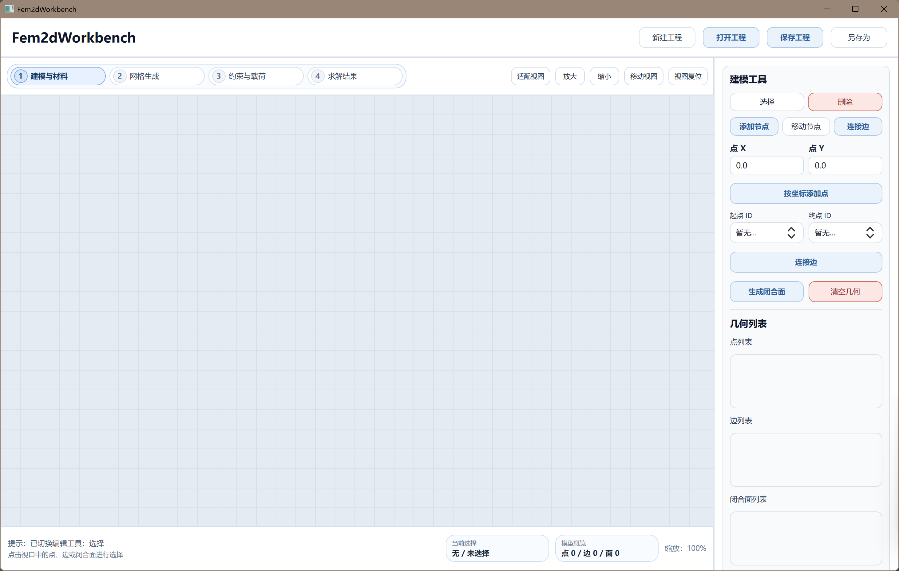
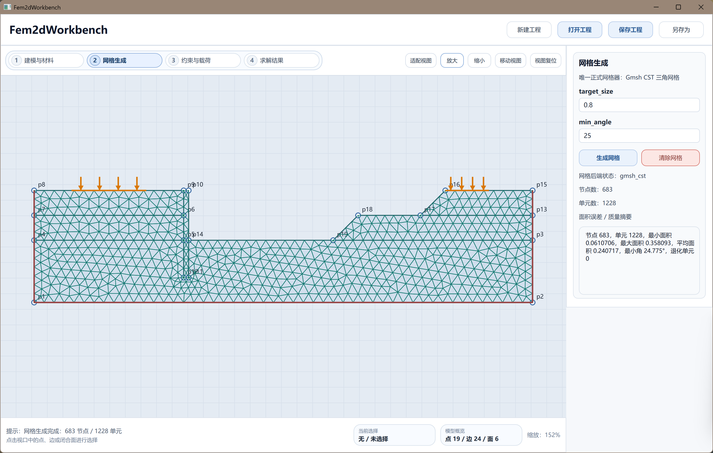
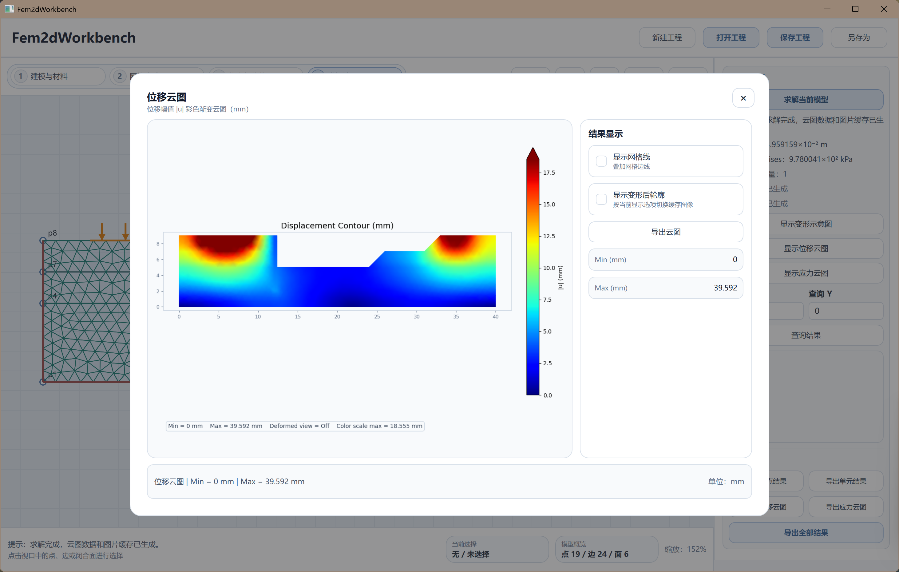
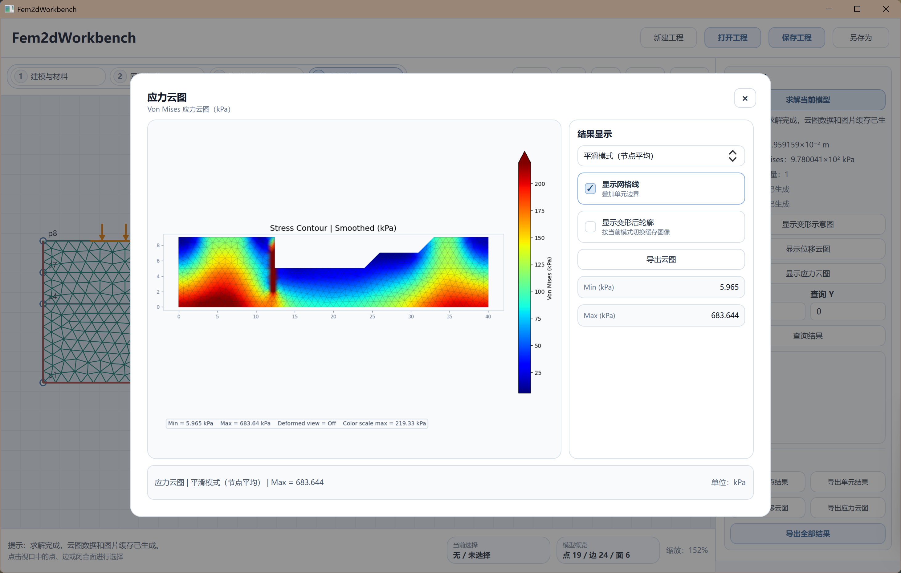
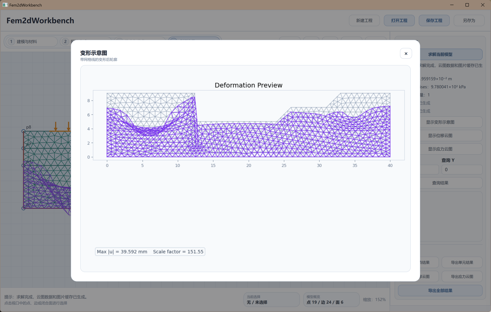

# Fem2dWorkbench🧩 

**Fem2dWorkbench** 是一款面向二维有限元建模、求解与结果可视化的轻量级工程分析软件。软件以工程工作台流程为核心，支持用户完成二维几何建模、材料定义、网格生成、约束与载荷设置、有限元求解、云图显示和结果导出等操作。

当前稳定版本为 **v0.2.6**，主要面向二维线弹性静力问题，可用于有限元教学演示、课程设计、软件著作权材料展示和轻量级工程分析流程验证。

---

## 🚀 下载与运行

### Windows 绿色版

> 推荐普通用户使用绿色版，无需配置运行环境，开箱即用。

[⬇️ 下载 Fem2dWorkbench v0.2.6 Windows 绿色版](https://github.com/ryancyx/Fem2dWorkbench/releases/download/v0.2.6/Fem2dWorkbench_v0.2.6_green.zip)

使用方法：

1. 下载 `Fem2dWorkbench_v0.2.6_green.zip`
2. 解压到任意文件夹
3. 进入解压后的目录
4. 双击运行 `Fem2dWorkbench.exe`

---

## 🎯 项目定位

Fem2dWorkbench 不仅仅是一个有限元求解脚本，也是一个具有完整前处理、求解和后处理流程的桌面端有限元工作台软件。

软件当前重点支持：

* 二维几何区域建模
* 材料参数定义与分配
* 三角形有限元网格生成
* 位移约束与外部载荷设置
* 二维线弹性静力求解
* 位移云图、Von Mises 应力云图与变形示意图显示
* 节点结果、单元结果和云图导出
* Windows 绿色版封装运行

---

## 🖼️ 软件截图

### 主界面



### 网格显示



### 位移云图



### Von Mises 应力云图



### 变形示意图



---

## ✨ 主要功能

### 1. 建模与材料

用户可以在软件中创建二维几何模型，包括节点、边和闭合面。软件支持对几何区域分配材料参数，包括弹性模量、泊松比、厚度和密度等。

### 2. 网格生成

软件支持对二维闭合区域生成三角形有限元网格。用户可以设置目标网格尺寸，并在主视口中查看生成后的网格节点和单元。

### 3. 约束与载荷

软件支持设置位移边界条件和外部载荷。用户可以对指定边界施加固定约束、方向约束和集中或边界载荷，并通过列表查看当前模型中的约束和载荷信息。

### 4. 有限元求解

软件内置二维线弹性静力有限元求解流程，包括刚度矩阵装配、载荷向量构造、边界条件处理、线性方程组求解和结果回写。

### 5. 结果后处理

求解完成后，软件可以显示最大位移、最大 Von Mises 应力等关键结果，并支持查看：

* 变形示意图
* 位移云图
* Von Mises 应力云图
* 指定坐标附近的结果查询

### 6. 结果导出

软件支持将分析结果导出到本地文件夹，包括：

* 节点结果
* 单元结果
* 位移云图
* 应力云图
* 全部结果汇总

---

## 🛠️ 技术栈

| 模块    | 技术                      |
| ----- | ----------------------- |
| 开发语言  | Python                  |
| 桌面界面  | PySide6 + QML           |
| 数值计算  | NumPy + SciPy           |
| 云图绘制  | Matplotlib              |
|  网格器   | Gmsh                    |
| 有限元模型 | 二维 CST 三角形单元            |
| 测试工具  | pytest                  |
| 打包工具  | PyInstaller             |
| 运行平台  | Windows 10 / Windows 11 |

---

## 🧱 软件架构

Fem2dWorkbench 采用模块化分层设计，主要包括：

```text
Fem2dWorkbench/
├─ main.py                         # 程序入口
├─ app/
│  ├─ domain/                      # 工程数据模型
│  ├─ solver/                      # 有限元求解器
│  ├─ services/                    # 网格、编译、求解、后处理服务
│  ├─ bridge/                      # Python 与 QML 桥接层
│  └─ ui/                          # QML 界面文件
├─ tests/                          # 自动化测试
├─ docs/                           # 文档与截图
└─ dist/                           # 打包输出目录
```

软件内部将工程数据模型、有限元求解器、服务层和界面层分离，便于后续扩展四边形单元、多零件装配、自定义网格器和更复杂材料模型。

---

## ⚡ 从源码运行

本教程面向开发者。

克隆项目：

```bash
git clone https://github.com/ryancyx/Fem2dWorkbench.git
cd Fem2dWorkbench
```

创建并激活 conda 环境：

```bash
conda create -n fem2dworkbench python=3.11
conda activate fem2dworkbench
```

安装依赖：

```bash
pip install -r requirements.txt
```

运行软件：

```bash
python main.py
```

---

## 📌 基本使用流程

建议按以下流程使用：

```text
建模与材料 → 网格生成 → 约束与载荷 → 求解结果
```

### 1. 创建几何模型

在“建模与材料”模块中创建二维区域，添加节点、连接边，并形成闭合面。

### 2. 设置材料参数

编辑材料的弹性模量、泊松比、厚度和密度，并将材料应用到当前闭合面或全部闭合面。

### 3. 生成网格

进入“网格生成”模块，设置目标网格尺寸，生成三角形有限元网格。

### 4. 设置约束和载荷

进入“约束与载荷”模块，为模型边界设置固定约束或方向约束，并施加外部载荷。

### 5. 执行求解

进入“求解结果”模块，点击求解按钮，软件将自动完成有限元模型编译、求解和结果刷新。

### 6. 查看和导出结果

求解完成后，可以查看位移云图、应力云图和变形示意图，也可以将节点结果、单元结果和云图导出到指定文件夹。

---

## 🧪 案例展示

### 二维薄板受载分析

典型案例为二维薄板受拉或受压分析。用户可以创建一个矩形薄板模型，在左侧边界施加固定约束，在右侧边界施加水平载荷，然后生成网格并求解。

分析完成后，软件可以显示：

* 薄板整体变形趋势
* 最大位移位置
* Von Mises 应力分布
* 应力集中区域
* 节点与单元结果数据

该案例可用于展示软件从建模、网格、边界条件设置到有限元求解和后处理的完整流程。

---

## 📦 当前版本

当前稳定版本：**v0.2.6**

### v0.2.6 已完成功能

* 完整单模型二维有限元分析流程
* 二维几何建模与材料分配
* 三角形有限元网格生成
* 位移约束与载荷设置
* 二维线弹性静力求解
* 位移云图显示
* Von Mises 应力云图显示
* 变形示意图显示
* 节点结果和单元结果导出
* 云图导出
* Windows 绿色版封装

---

## ⚠️ 当前限制

当前版本仍处于轻量级工作台阶段，主要限制包括：

* 当前主要支持二维线弹性静力分析
* 当前主要使用三角形 CST 单元
* 暂不支持真实四边形 Q4 单元求解
* 暂不支持复杂接触、非线性材料和大变形分析
* 多零件装配功能仍处于后续扩展方向
* 当前软件主要面向 Windows 平台封装和运行

---

## 🗺️ 后续计划

后续版本计划继续扩展：

* 四节点四边形 Q4 单元
* 更高质量的网格生成器
* 用户自定义网格器导入
* 多零件装配建模
* 平面应变分析
* 弹塑性材料模型
* 更丰富的应力、应变和路径结果后处理
* 更完善的工程文件保存与版本管理

---

## 📚 项目用途

本项目可用于：

* 有限元课程设计
* 二维有限元教学演示
* Python + QML 桌面软件开发实践
* 有限元软件架构学习
* 软件著作权申请材料支撑
* 工程分析软件原型验证

---

## 👤 开发相关

开发者：Developed by Ryan Cheung @ryancyx | Supervised by Professor Wang Meng
项目来源：四川大学力学系计算力学课程 

---

## 📄 License

本项目当前主要用于课程项目、学习研究和软件原型开发。若需用于商业场景或二次开发，请联系项目作者确认授权方式。
